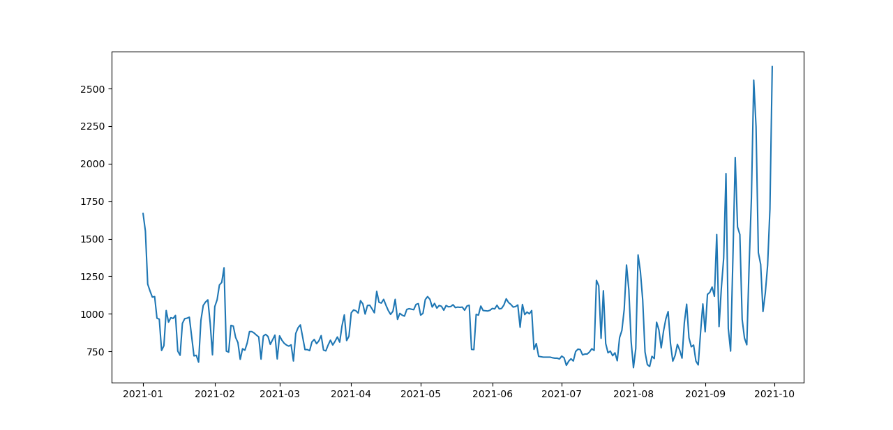

# webservice_hidro
Python scripts to extract data from HIDRO Webservice (ANA)

Scripts em Python para extrair os dados requisitados do Webservice HIDRO da Agência Nacional de Águas (ANA),  armazenando-os em arquivo csv.

~~~~python

from webservice_hidro import retorna_inventario

# Seleção do inventário de estações fluviométricas no Estado de Alagoas
inventario = retorna_inventario(tpEst=1, nmEstado="ALAGOAS")

print(inventario.head())

~~~~

Resultado (10 primeiras colunas):
|    |   BaciaCodigo |   SubBaciaCodigo |   RioCodigo | RioNome      |   EstadoCodigo | nmEstado   |   MunicipioCodigo | nmMunicipio        |   ResponsavelCodigo | ResponsavelSigla   |
|---:|--------------:|-----------------:|------------:|:-------------|---------------:|:-----------|------------------:|:-------------------|--------------------:|:-------------------|
|  0 |             3 |               39 |    39742000 | RIO JACUÍPE  |             13 | ALAGOAS    |          13021000 | COLÔNIA LEOPOLDINA |                 104 | CPRH-PE            |
|  1 |             3 |               39 |    39742000 | RIO JACUÍPE  |             13 | ALAGOAS    |          13035000 | JACUÍPE            |                   1 | ANA                |
|  2 |             3 |               39 |    39742000 | RIO JACUÍPE  |             13 | ALAGOAS    |          13035000 | JACUÍPE            |                 121 | SEMARH-AL          |
|  3 |             3 |               39 |    39751500 | RIO MARAGOGI |             13 | ALAGOAS    |          13045000 | MARAGOGI           |                 121 | SEMARH-AL          |
|  4 |             3 |               39 |    39753500 | RIO MANGUABA |             13 | ALAGOAS    |          13073000 | PORTO CALVO        |                   1 | ANA                |

~~~~python

from webservice_hidro import retorna_inventario

# Seleção dos dados brutos de vazão da estação fluviométrica
# PIRANHAS - Código: 49330000 em Piranhas/Alagoas para o ano de 2021
serie_historica = retorna_serie_historica(codEstacao=49330000, tiposDados=3,
                            dataInicio="01/01/2021", dataFim="31/12/2021",
                            nivelConsistencia=1)

print(serie_historica.head())

~~~~

Resultado (10 primeiras colunas):

|    |   EstacaoCodigo |   NivelConsistencia | DataHora            |   MediaDiaria |   MetodoObtencaoVazoes |   Maxima |   Minima |    Media |   DiaMaxima |   DiaMinima |
|---:|----------------:|--------------------:|:--------------------|--------------:|-----------------------:|---------:|---------:|---------:|------------:|------------:|
|  0 |        49330000 |                   1 | 2021-09-01 00:00:00 |             1 |                      1 |  2645.99 |  752.105 | 1386.45  |          30 |          12 |
|  1 |        49330000 |                   1 | 2021-08-01 00:00:00 |             1 |                      1 |  1392.29 |  641.894 |  848.749 |           3 |           1 |
|  2 |        49330000 |                   1 | 2021-07-01 00:00:00 |             1 |                      1 |  1325.35 |  657.306 |  832.353 |          29 |           3 |
|  3 |        49330000 |                   1 | 2021-06-01 00:00:00 |             1 |                      1 |  1100.58 |  699.596 |  910.406 |           7 |          30 |
|  4 |        49330000 |                   1 | 2021-05-01 00:00:00 |             1 |                      1 |  1115.21 |  762.053 | 1024.48  |           4 |          24 |

~~~~python

from webservice_hidro import reorganiza_serie_em_coluna

serie_em_coluna = reorganiza_serie_em_coluna(serie_historica)

print(serie_em_coluna.head())

~~~~

Resultado:

|    | Data                |   Valor |
|---:|:--------------------|--------:|
|  0 | 2021-01-01 00:00:00 | 1667.93 |
|  1 | 2021-01-02 00:00:00 | 1550.98 |
|  2 | 2021-01-03 00:00:00 | 1197.93 |
|  3 | 2021-01-04 00:00:00 | 1152.32 |
|  4 | 2021-01-05 00:00:00 | 1111.54 |

~~~~python

from matplotlib import pyplot as plt

plt.plot(serie_em_coluna.Data, serie_em_coluna.Valor)

plt.show()

~~~~

