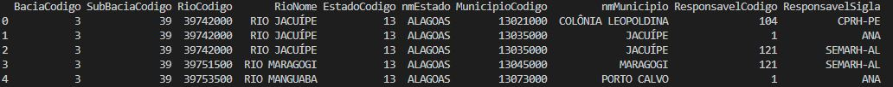

# webservice_hidro
Python scripts to extract data from HIDRO Webservice (ANA)

Scripts em Python para extrair os dados requisitados do Webservice HIDRO da Agência Nacional de Águas (ANA),  armazenando-os em arquivo csv.

~~~~python

from webservice_hidro import retorna_inventario

inventario = retorna_inventario(tpEst=1, nmEstado="ALAGOAS")

print(inventario.head())

~~~~

Resultado:

