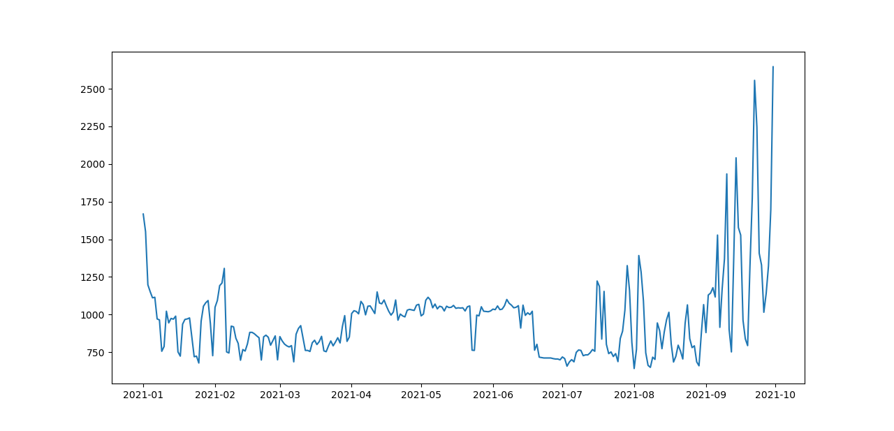

# webservice_hidro

Python scripts to extract data from HIDRO Webservice (ANA)

Scripts em Python para extrair os dados requisitados do Webservice HIDRO da Agência Nacional de Águas (ANA),  armazenando-os em um Pandas DataFrame.

```python

from webservice_hidro import retorna_inventario

# Seleção do inventário de estações fluviométricas no Estado de Alagoas
# Retorna uma lista de Dicionários do tipo Inventário
inventario = retorna_inventario(tpEst=1, nmEstado="ALAGOAS")

print(inventario[0])  # Mostra o primeiro item com todos os campos

```

Os campos do TypedDict `Inventario` incluem:

```python
{
    "BaciaCodigo": str | None,
    "SubBaciaCodigo": str | None,
    "RioCodigo": str | None,
    "RioNome": str | None,
    "EstadoCodigo": str | None,
    "nmEstado": str | None,
    "MunicipioCodigo": str | None,
    "nmMunicipio": str | None,
    "ResponsavelCodigo": str | None,
    "ResponsavelSigla": str | None,
    "ResponsavelUnidade": str | None,
    "ResponsavelJurisdicao": str | None,
    "OperadoraCodigo": str | None,
    "OperadoraSigla": str | None,
    "OperadoraUnidade": str | None,
    "OperadoraSubUnidade": str | None,
    "TipoEstacao": str | None,
    "Codigo": str | None,
    "Nome": str | None,
    "CodigoAdicional": str | None,
    "Latitude": str | None,
    "Longitude": str | None,
    "Altitude": str | None,
    "AreaDrenagem": str | None,
    "TipoEstacaoEscala": str | None,
    "TipoEstacaoRegistradorNivel": str | None,
    "TipoEstacaoDescLiquida": str | None,
    "TipoEstacaoSedimentos": str | None,
    "TipoEstacaoQualAgua": str | None,
    "TipoEstacaoPluviometro": str | None,
    "TipoEstacaoRegistradorChuva": str | None,
    "TipoEstacaoTanqueEvapo": str | None,
    "TipoEstacaoClimatologica": str | None,
    "TipoEstacaoPiezometria": str | None,
    "TipoEstacaoTelemetrica": str | None,
    "PeriodoEscalaInicio": str | None,
    "PeriodoEscalaFim": str | None,
    "PeriodoRegistradorNivelInicio": str | None,
    "PeriodoRegistradorNivelFim": str | None,
    "PeriodoDescLiquidaInicio": str | None,
    "PeriodoDescLiquidaFim": str | None,
    "PeriodoSedimentosInicio": str | None,
    "PeriodoSedimentosFim": str | None,
    "PeriodoQualAguaInicio": str | None,
    "PeriodoQualAguaFim": str | None,
    "PeriodoPluviometroInicio": str | None,
    "PeriodoPluviometroFim": str | None,
    "PeriodoRegistradorChuvaInicio": str | None,
    "PeriodoRegistradorChuvaFim": str | None,
    "PeriodoTanqueEvapoInicio": str | None,
    "PeriodoTanqueEvapoFim": str | None,
    "PeriodoClimatologicaInicio": str | None,
    "PeriodoClimatologicaFim": str | None,
    "PeriodoPiezometriaInicio": str | None,
    "PeriodoPiezometriaFim": str | None,
    "PeriodoTelemetricaInicio": str | None,
    "PeriodoTelemetricaFim": str | None,
    "TipoRedeBasica": str | None,
    "TipoRedeEnergetica": str | None,
    "TipoRedeNavegacao": str | None,
    "TipoRedeCursoDagua": str | None,
    "TipoRedeEstrategica": str | None,
    "TipoRedeCaptacao": str | None,
    "TipoRedeSedimentos": str | None,
    "TipoRedeQualAgua": str | None,
    "TipoRedeClasseVazao": str | None,
    "UltimaAtualizacao": str | None,
    "Operando": str | None,
    "Descricao": str | None,
    "NumImagens": str | None,
    "DataIns": str | None,
    "DataAlt": str | None
}
```
Alternativamente, pode-se aplicar a função `retorna_inventario_em_dataframe` para obter-se um DataFrame com o inventário de estações desejadas com os tipos de dados dos campos já identificados e convertidos.

```python

from webservice_hidro import retorna_inventario_em_dataframe

# Seleção do inventário de estações fluviométricas no Estado de Alagoas
inventario = retorna_inventario_em_dataframe(tpEst=1, nmEstado="ALAGOAS")

print(inventario.head())

```

Resultado (10 primeiras colunas):
|    |   BaciaCodigo |   SubBaciaCodigo |   RioCodigo | RioNome      |   EstadoCodigo | nmEstado   |   MunicipioCodigo | nmMunicipio        |   ResponsavelCodigo | ResponsavelSigla   |
|---:|--------------:|-----------------:|------------:|:-------------|---------------:|:-----------|------------------:|:-------------------|--------------------:|:-------------------|
|  0 |             3 |               39 |    39742000 | RIO JACUÍPE  |             13 | ALAGOAS    |          13021000 | COLÔNIA LEOPOLDINA |                 104 | CPRH-PE            |
|  1 |             3 |               39 |    39742000 | RIO JACUÍPE  |             13 | ALAGOAS    |          13035000 | JACUÍPE            |                   1 | ANA                |
|  2 |             3 |               39 |    39742000 | RIO JACUÍPE  |             13 | ALAGOAS    |          13035000 | JACUÍPE            |                 121 | SEMARH-AL          |
|  3 |             3 |               39 |    39751500 | RIO MARAGOGI |             13 | ALAGOAS    |          13045000 | MARAGOGI           |                 121 | SEMARH-AL          |
|  4 |             3 |               39 |    39753500 | RIO MANGUABA |             13 | ALAGOAS    |          13073000 | PORTO CALVO        |                   1 | ANA                |

```python

from enums_hidro import NivelDeConsistencia
from webservice_hidro import retorna_serie_historica

# Seleção dos dados brutos de vazão da estação fluviométrica
# PIRANHAS - Código: 49330000 em Piranhas/Alagoas para o ano de 2021
serie_historica = retorna_serie_historica(
    codEstacao=49330000,
    tipoDados=3,
    dataInicio="01/01/2021",
    dataFim="31/12/2021",
    nivelConsistencia=NivelDeConsistencia.BRUTO
)

print(serie_historica.head())

```

Resultado (10 primeiras colunas):

|    |   EstacaoCodigo |   NivelConsistencia | DataHora            |   MediaDiaria |   MetodoObtencaoVazoes |   Maxima |   Minima |    Media |   DiaMaxima |   DiaMinima |
|---:|----------------:|--------------------:|:--------------------|--------------:|-----------------------:|---------:|---------:|---------:|------------:|------------:|
|  0 |        49330000 |                   1 | 2021-09-01 00:00:00 |             1 |                      1 |  2645.99 |  752.105 | 1386.45  |          30 |          12 |
|  1 |        49330000 |                   1 | 2021-08-01 00:00:00 |             1 |                      1 |  1392.29 |  641.894 |  848.749 |           3 |           1 |
|  2 |        49330000 |                   1 | 2021-07-01 00:00:00 |             1 |                      1 |  1325.35 |  657.306 |  832.353 |          29 |           3 |
|  3 |        49330000 |                   1 | 2021-06-01 00:00:00 |             1 |                      1 |  1100.58 |  699.596 |  910.406 |           7 |          30 |
|  4 |        49330000 |                   1 | 2021-05-01 00:00:00 |             1 |                      1 |  1115.21 |  762.053 | 1024.48  |           4 |          24 |

```python

from enums_hidro import TipoDeVariavel
from webservice_hidro import reorganiza_serie_em_coluna

serie_em_coluna = reorganiza_serie_em_coluna(
    dados_api=serie_historica, # Série Histórica em formato de DataFrame
    variavel=TipoDeVariavel.VAZAO
)

print(serie_em_coluna.head())

```

Resultado:

|            | EstacaoCodigo | NivelConsistencia |   Vazao |
|:---------- |--------------:|------------------:|--------:|
| Data       |               |                   |         |
| 2021-01-01 |      49330000 |                 2 | 1667.93 |
| 2021-01-02 |      49330000 |                 2 | 1550.98 |
| 2021-01-03 |      49330000 |                 2 | 1197.93 |
| 2021-01-04 |      49330000 |                 2 | 1152.32 |
| 2021-01-05 |      49330000 |                 2 | 1111.54 |

```python

from matplotlib import pyplot as plt

serie_em_coluna[['Vazao']].plot()

plt.show()

```


